# 微服务管理（上）
**@author：Davie**
**版权所有：北京千锋互联科技有限公司**

## 一、微服务管理--服务发现

在微服务简介篇，我们已经介绍过微服务架构中要解决的四个基本的问题。从本节课开始我们来学习如何实现服务的管理。

### 1.1、为什么要使用服务发现

设想下，我们写了一些通过REST API或者Thrift API调用某个服务的代码，为了发起这个请求，代码需要知道服务实例的网络地址(IP 地址和端口号）。在传统运行在物理机器上的应用中，某个服务实例的网络地址一般是静态的，比如，代码可以从只会偶尔更新的配置文件中读取网络地址。

然而在现在流行的基于云平台的微服务应用中， 有更多如下图所示的困难问题需要去解决：

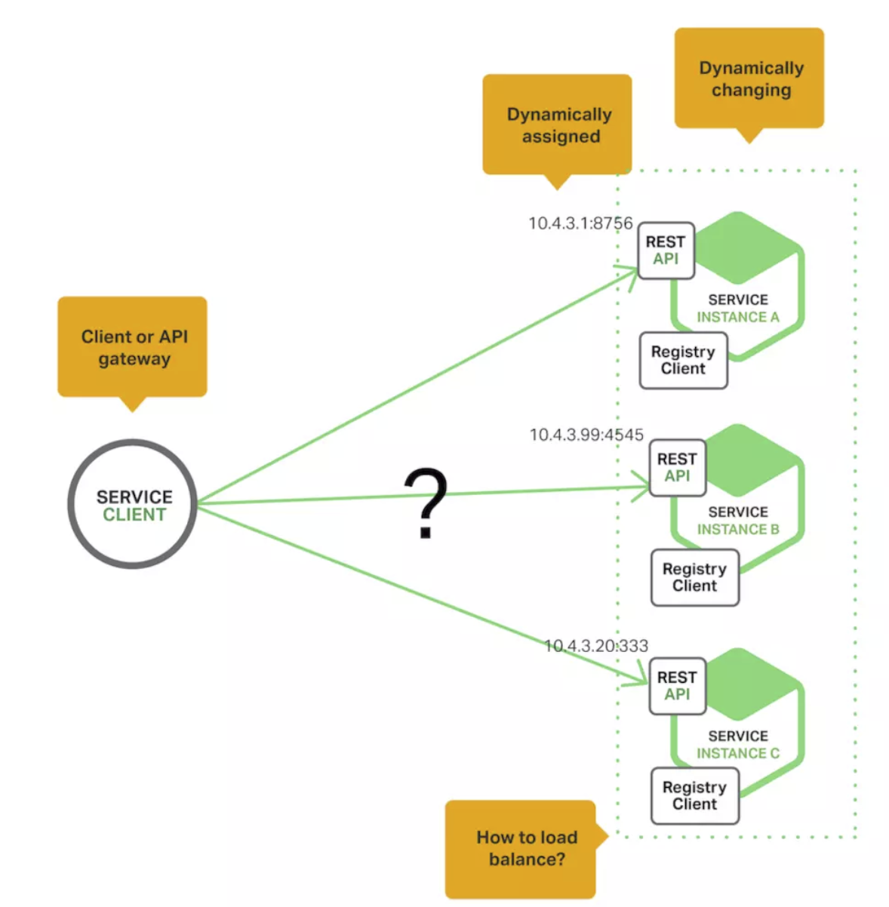

服务实例需要动态分配网络地址，而且，一组服务实例可能会因为自动扩展、失败或者升级发生动态变化，因此客户端代码应该使用更加精细的服务发现机制。

在生产实践中，主要有两种服务发现机制：**客户端发现**和**服务端发现**。我们分别来介绍这两种机制：

### 1.2、客户端发现模式
当我们使用客户端发现的时候，客户端负责决定可用服务实例的网络地址并且在集群中对请求负载均衡, 客户端访问**服务登记表**，也就是一个可用服务的数据库，然后客户端使用一种负载均衡算法选择一个可用的服务实例然后发起请求。该模式如下图所示：

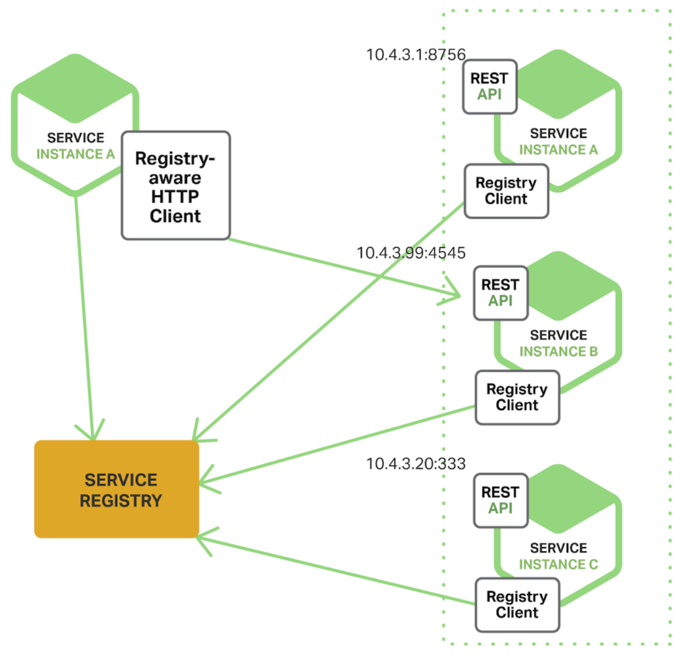

该模式和我们之前在微服务简介章节介绍的服务发现机制中的客户端机制是一样的，如图所示：


服务实例的网络地址在服务启动的时候被登记到服务注册表中 ，当实例终止服务时从服务注册表中移除。服务实例的注册一般是通过**心跳机制**阶段性的进行刷新。

* **客户端发现机制的优势：**
    * 该模式中只增加了服务注册表，整体架构也相对简单；
    * 客户端可以使用更加智能的，特定于应用的负载均衡机制，如一致性哈希。
* **客户端发现机制的缺点：** 客户端发发现机制中，客户端与服务注册表紧密耦合在一起，开发者必须为每一种消费服务的客户端对应的编程语言和框架版本都实现服务发现逻辑。

* **客户端发现模式的应用：**往往大公司会采用客户端发现机制来实现服务的发现与注册的模式。

### 1.3、服务端发现模式
与客户端发现模式对应的，另外一种服务发现模式称之为服务端发现模式，整体架构如下：

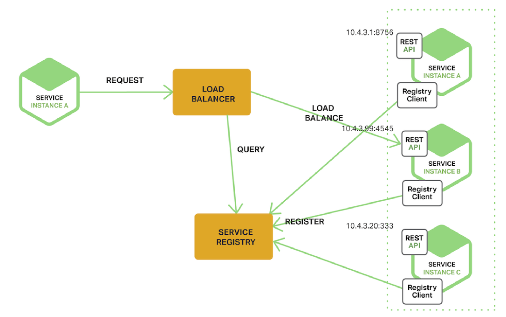

在该种模式下，客户端通过一个负载均衡器向服务发送请求，负载均衡器查询服务注册表并把请求路由到一台可用的服务实例上。和客户端发现一样，服务实例通过服务注册表进行服务的注册和注销。

同样的，服务端发下模式也有优势和缺点：

* **服务端发现模式的优点：**
    * 服务发现的细节对客户端来说是抽象的，客户端仅需向负载均衡器发送请求即可。
    * 这种方式减少了为消费服务的不同编程语言与框架实现服务发现逻辑的麻烦。很多部署环境已经提供了该功能。
* **服务端发现模式的缺点：** 除非部署环境已经提供了负载均衡器，否则这又是一个需要额外设置和管理的可高可用的系统组件。

### 1.4、服务注册表
服务注册表是服务发现的关键部分，它是一个包含服务实例网络地址的的数据库。一个服务注册表需要高可用和实时更新，客户端可以缓存从服务注册表获取的网络地址。然而，这样的话缓存的信息最终会过期，客户端不能再根据该信息发现服务实例。因此，服务注册表对集群中的服务实例使用复制协议来维护一致性。

举个例子：Netflix Eureka是典型的服务注册表的案例实现，它为服务实例的注册与查询提供了REST API：**一个服务实例可以使用POST来注册自己的网络地址，它必须每30秒通过PUT去刷新，服务实例可以直接或者在服务实例注册超时的时候使用DELETE删除注册表中的信息，另外客户端可以使用HTTP GET获取注册实例的信息。**

当然，除了Netflix Eureka以外，还有：
* **etcd：**一个高可用、分布式、一致性、key-value方式的存储，被用在分享配置和服务发现中。两个著名的项目使用了它：Kubernetes和Cloud Foundry。
* **consul：**一个发现和配置服务的工具，为客户端注册和发现服务提供了API，Consul还可以通过执行健康检查决定服务的可用性。

* **Apache Zookeeper：**Zookeeper是一个广泛使用、高性能的针对分布式应用的协调服务。 Apache Zookeeper本来是Hadoop的子工程，现在已经是顶级工程了。

### 1.5、服务注册方式
服务实例必须使用服务注册表来进行服务的注册和注销，在实践过程中有不同的方式来实现服务的注册和注销：

* **self-registration模式：**这种模式下，服务实例自己负责通过服务注册表对自己进行注册和注销，另外如何有必要的话，服务实例可以通过发送心跳包请求防止注册过期。该种模式的架构实现如下：
* 
    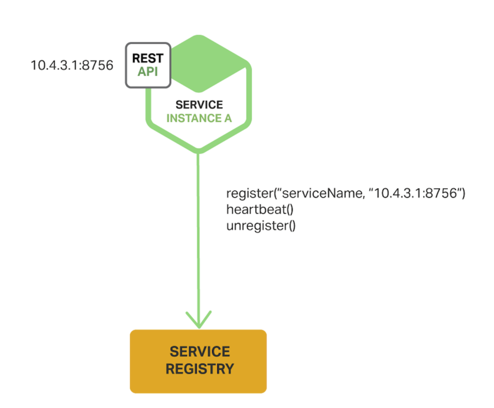
    
    **self-registration**模式有一些优势也有一些劣势：优势之一是它相对简单，而且不强制使用其他的系统组件。然而，一个很大的劣势是 它使得服务实例和服务注册表强耦合 ，你必须在每一个使用服务的客户端编程语言和架构代码中实现注册逻辑。
    
* **third-party registration模式：**当使用third-party registration模式的时候，服务实例本身并不负责通过服务注册表注册自己，相反的，通过另一个被称作service registrar系统组件来处理注册。service registrar通过轮询或者订阅事件来检测一些运行实例的变化，当它检测到一个新的可用服务实例时就把该实例注册到服务注册表中去，service registrar还负责注销已经被终止的服务实例，下图展示了该模式的架构：
    
    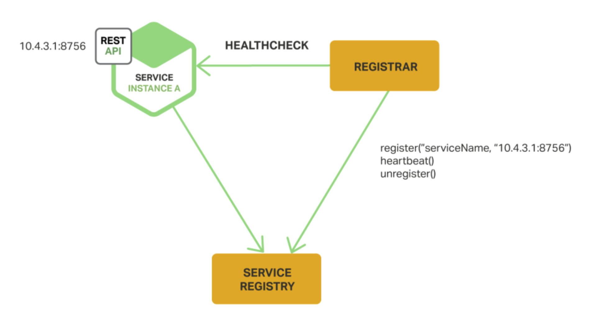
    
    third-party registration模式也有一些优势和劣势：主要优势是使得服务从服务注册表中被解耦，你不必为开发者使用的每种开发语言和框架实现服务注册的逻辑，相反，服务实例的注册被一个专有服务以集中式的方式处理。该模式的劣势是，除非它被内置在部署环境中，不然这又是一个需要被设置和管理的高可用系统组件。
    
### 1.6、总结
在一个微服务应用中，一组运行的服务实例是动态变化的，实例有动态分配的网络地址，因此，为了使得客户端能够向服务发起请求，必须要要有服务发现机制。

服务发现的关键是服务注册表，服务注册表是可用服务实例的数据库，它提供了管理和查询使用的API。服务实例使用这些管理API进行服务的注册和注销，系统组件使用查询API来发现可用的服务实例。

* 客户端发现的案例：Eureka、ZooKeeper
* 服务端发现的案例：consul+nigix

我们选择Consul来进行学习。

### 1.7、Consul
* **Consul概述**
consul是google开源的一个使用go语言开发的服务发现、配置管理中心服务，consul属于微服务架构的基础设置中用于发现和配置服务的一个工具。Consul提供如下的几个核心功能：
    
    * **服务发现：**Consul的某些客户端可以提供一个服务，其他客户端可以使用Consul去发现这个服务的提供者。
    
    * **健康检查：**Consul客户端可以提供一些健康检查，这些健康检查可以关联到一个指定的服务，比如心跳包的检测。
    
    * **键值存储：**应用实例可以使用Consul提供的分层键值存储，比如动态配置，特征标记，协作等。通过HTTP API的方式进行获取。

    * **多数据中心：**Consul对多数据中心有非常好的支持。

* **官方网站：**
可以访问[https://www.consul.io/](https://www.consul.io/)查看Consul的相关介绍，获取相关资料。

* **安装：**
在官方文档中，点击Download按钮，进入下载软件界面[https://www.consul.io/downloads.html](https://www.consul.io/downloads.html)，选择自己本机系统的类型，如下图所示：

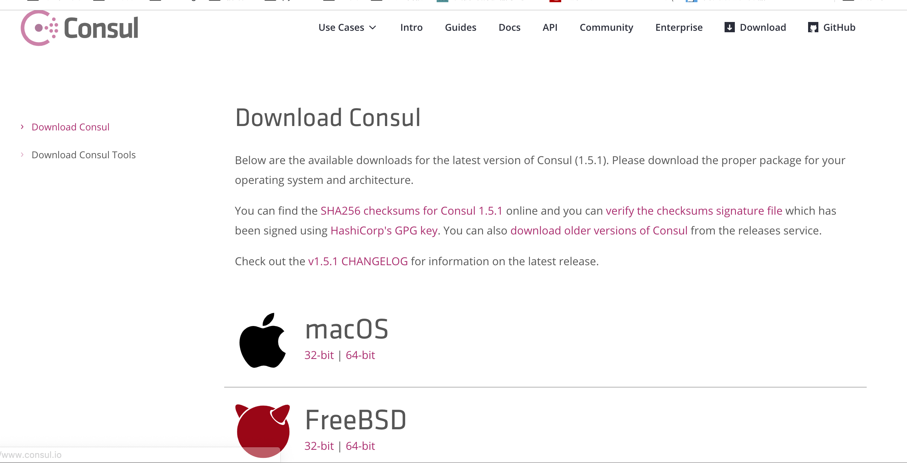

Consul最新版本是v1.5.1版本。

## 二、微服务管理--分布式与单点故障
上节课我们提到了服务的注册于发现机制，可以引入一个服务注册发现组件来实现对服务的管理，完成服务注册，信息查询，存储配置等功能。虽然引入了服务注册发现组件解决了就问题，但是会引入新问题。

### 2.1、Consul环境配置

* 1、将下载的consul_1.5.1_darwin_amd64.zip进行解压，解压后得到可执行文件consul。

* 2、将consul可执行文件拷贝到电脑本地的环境变量中。
    * Unix系统中：可以拷贝到**~/bin**或**/usr/local/bin**目录下，这两个目录是常见的安装目录。
    * Windows系统：可以将consul安装到**%PATH%**所对应的目录路径中。
    以macOS系统为例，属于unix系统，将consul拷贝到/usr/local/bin目录下，如图所示：
    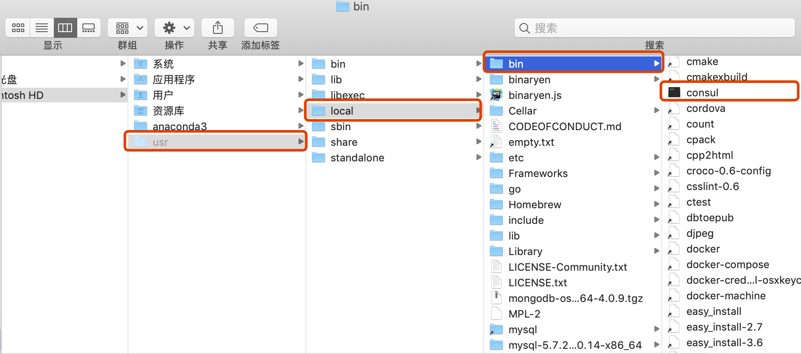
    
* 3、测试配置成功
完成consul的环境配置后，即表示已经将consul完成了安装。可以通过在命令行中运行consul指令验证是否安装成功。打开命令行工具，输入如下指令：
    
    ```
    consul
    ```
    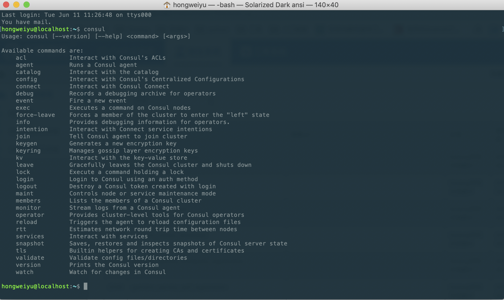
    在终端中输入**consul**指令，出现如上指令用法及参数提示，即表示consul安装成功。
    如果得到的是**-bash: consul: command not found**的错误，则表示**path**没有正确设置，需要重新检查consul可执行文件所在路径是否添加到了环境变量PATH中。

### 2.2、主从模式分布式系统
分布式系统中，一遍采用主从模式进行部署，如下图所示：


### 2.3、单点故障
通常分布式系统采用主从模式，就是一个主控机连接多个处理节点。主节点负责分发任务，从节点负责处理任务，当我们的主节点发生故障时，整个系统就瘫痪了。这就是单点故障。

单点故障（single point of failure），从英文字面上可以看到是单个点发生的故障，通常应用于计算机系统及网络。实际指的是单个点发生故障的时候会波及到整个系统或者网络，从而导致整个系统或者网络的瘫痪。这也是在设计IT基础设施时应避免的。

对应到上文，我们所说的服务注册与发现组件，如果我们引入的服务注册与发现组件出现了问题，则会导致系统乃至整个链路瘫痪，这是不可容忍的。需要采用新的方案解决此问题。

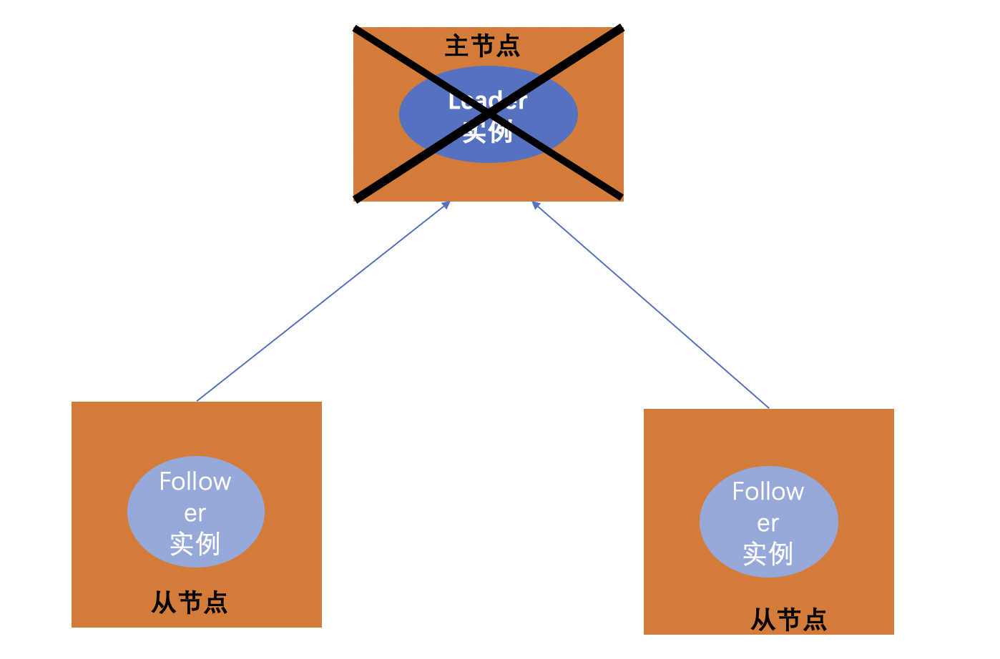

### 2.4、传统解决方案
传统的解决方案是采用一个备用节点，这个备用节点定期给当前主节点发送ping包，主节点收到ping包以后向备用节点发送回复ACK,当备用节点收到回复时就会认为当前主节点还活着，让他继续提供服务。
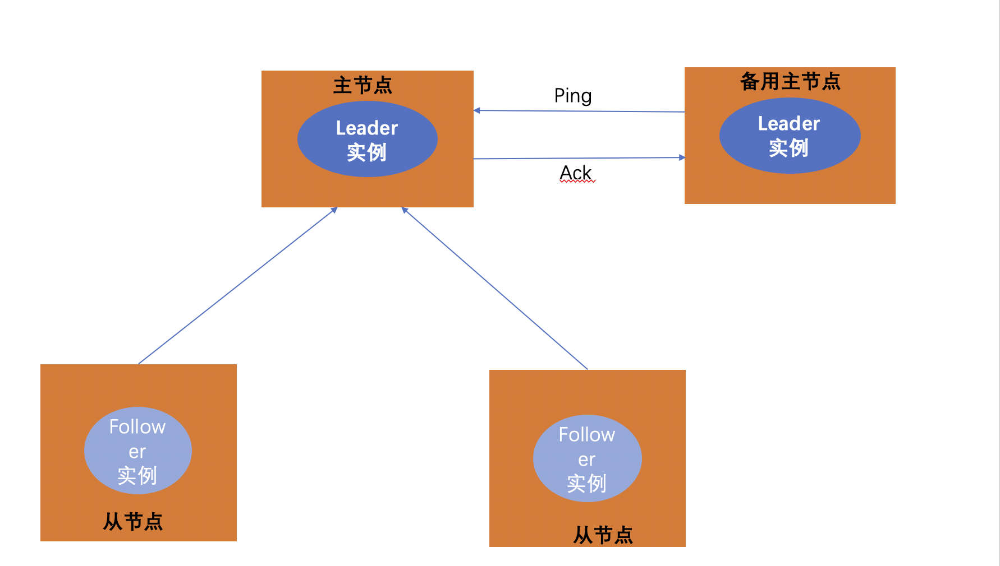

当主节点停止服务以后，这个时候备用节点收不到回复了，备用主节点认为主节点就宕机了，备用节点会代替主节点成为主节点，如下图：
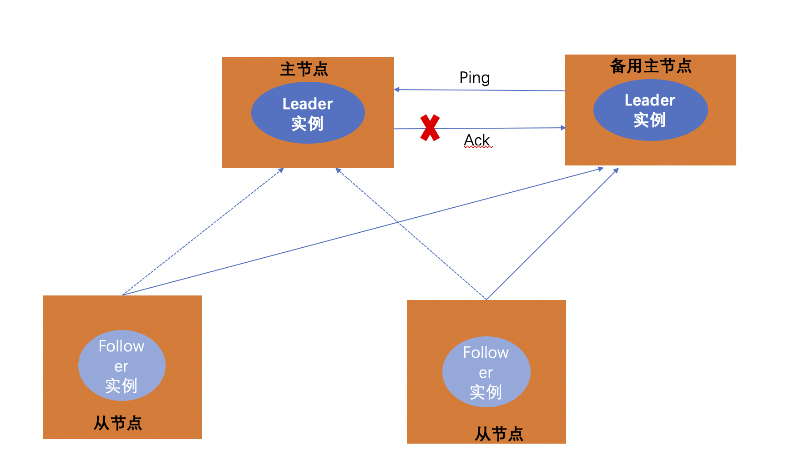

但是这种方案有个问题，如果仅仅是网络故障引起的ACK返回延时，这种方案就会面临着同时存在两个主节点的问题。

### 2.5、Consul中的Raft
Raft是一种基于Paxos的一致性算法。和Paxos相比，Raft的状态更少，算法更简单易懂。

Raft中的节点总是处于以下三种状态之一: follower、candidate或leader。所有的节点最初都是follower。在这种状态下，节点可以接受来自leader的日志条目并进行投票。如果在一段时间内没有收到条目，节点将自动提升到候选状态。在候选状态中，节点请求同级的选票。如果一个候选人获得了法定人数的选票，那么他就被提升为领袖。领导者必须接受新的日志条目，并将其复制给所有其他的追随者。此外，如果不能接受过时的读取，则还必须对leader执行所有查询。

### 2.6、Consul内部原理

我们可以通过如下的原理图来理解Consul的原理：
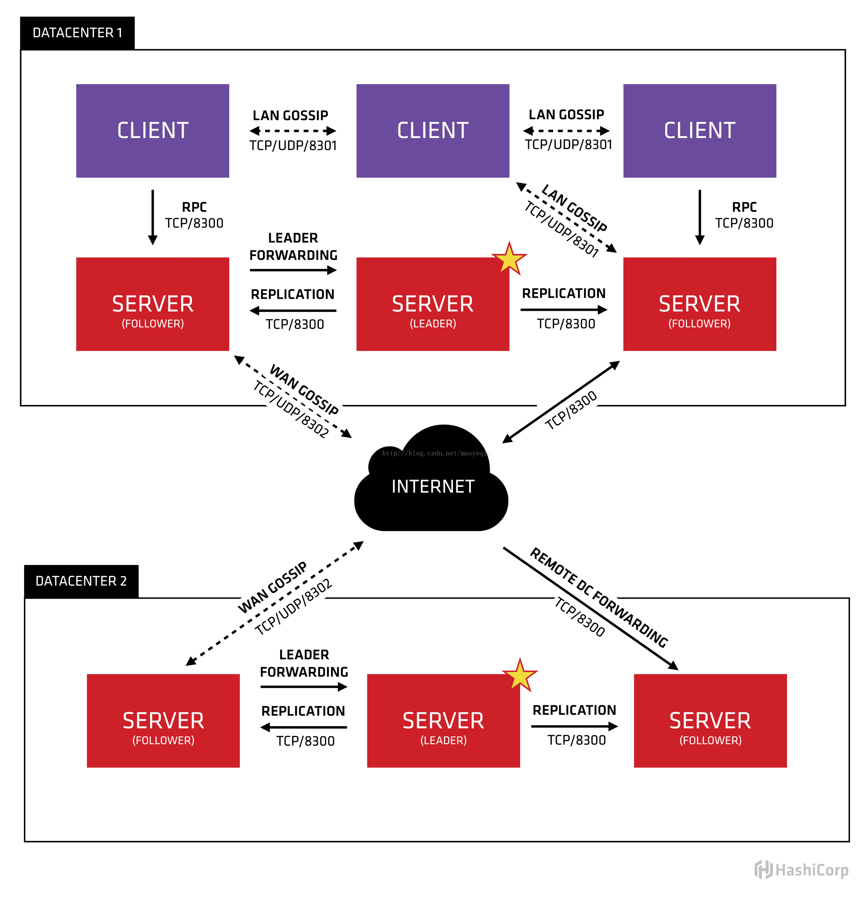
 
首先Consul支持多数据中心，在上图中有两个DataCenter，他们通过Internet互联，同时请注意为了提高通信效率，只有Server节点才加入跨数据中心的通信。

在单个数据中心中，Consul分为Client和Server两种节点（所有的节点也被称为Agent），Server节点保存数据，Client负责健康检查及转发数据请求到Server。

Server节点有一个Leader和多个Follower，Leader节点会将数据同步到Follower，Server的数量推荐是3个或者 5个，在Leader挂掉的时候会启动选举机制产生一个新的 Leader。

集群内的Consul节点通过gossip协议（流言协议）维护成员关系，也就是说某个节点了解集群内现在还有哪些节点，这些节点是Client还是Server。

单个数据中心的流言协议同时使用TCP和UDP通信，并且都使用8301端口。跨数据中心的流言协议也同时使用TCP和UDP 通信，端口使用8302。

集群内数据的读写请求既可以直接发到Server，也可以通过Client使用RPC转发到Server，请求最终会到达Leader节点。

在允许数据轻微陈旧的情况下，读请求也可以在普通的Server节点完成，集群内数据的读写和复制都是通过TCP的8300端口完成。

## 三、微服务管理--Consul服务发现原理

### 3.1、Consul服务发现原理
使用以下案例进行Consul服务发现原理的讲解，如图所示：


1、**部署集群。**首先需要有一个正常的Consul集群，有Server，有Leader。这里在服务器Server1、Server2、Server3上分别部署了Consul Server。

2、**选举Leader节点。**假设他们选举了Server2上的 Consul Server 节点为Leader。这些服务器上最好只部署Consul程序，以尽量维护Consul Server的稳定。

3、**注册服务。**然后在服务器Server4和Server5上通过Consul Client分别注册Service A、B、C，这里每个Service 分别部署在了两个服务器上，这样可以避免Service的单点问题。服务注册到Consul可以通过 HTTP API（8500 端口）的方式，也可以通过 Consul 配置文件的方式。

4、**Consul client转发注册消息。**Consul Client 可以认为是无状态的，它将注册信息通过RPC转发到Consul Server，服务信息保存在Server的各个节点中，并且通过Raft实现了强一致性。

5、**服务发起通信请求。**最后在服务器Server6中Program D需要访问Service B，这时候Program D首先访问本机Consul Client提供的HTTP API，本机Client会将请求转发到 Consul Server。

6、Consul Server查询到Service B当前的信息返回，最终Program D拿到了Service B的所有部署的IP和端口，然后就可以选择Service B的其中一个部署并向其发起请求了。

## 四、微服务管理--Consul启动
### 4.1、启动Consul
安装配置好Consul以后，我们可以通过简单的命令启动consul。先来看最简单的启动方式：

```
consul agent -dev
```
在新终端中，执行如上操作。

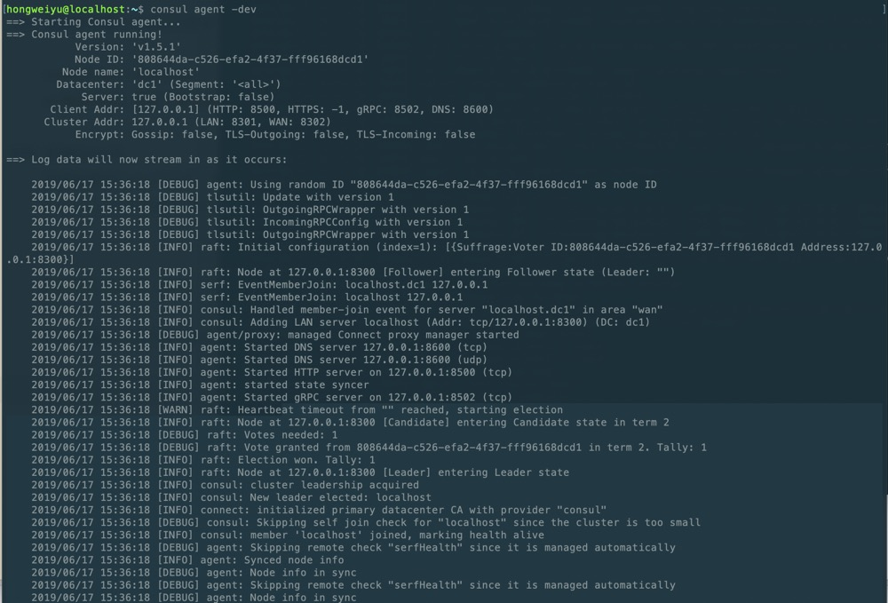

```
hongweiyu@localhost:~$ consul agent -dev
==> Starting Consul agent...
==> Consul agent running!
           Version: 'v1.5.1'
           Node ID: '808644da-c526-efa2-4f37-fff96168dcd1'
         Node name: 'localhost'
        Datacenter: 'dc1' (Segment: '<all>')
            Server: true (Bootstrap: false)
       Client Addr: [127.0.0.1] (HTTP: 8500, HTTPS: -1, gRPC: 8502, DNS: 8600)
      Cluster Addr: 127.0.0.1 (LAN: 8301, WAN: 8302)
           Encrypt: Gossip: false, TLS-Outgoing: false, TLS-Incoming: false

==> Log data will now stream in as it occurs:

    2019/06/17 15:36:18 [DEBUG] agent: Using random ID "808644da-c526-efa2-4f37-fff96168dcd1" as node ID
    2019/06/17 15:36:18 [DEBUG] tlsutil: Update with version 1
    2019/06/17 15:36:18 [DEBUG] tlsutil: OutgoingRPCWrapper with version 1
    2019/06/17 15:36:18 [DEBUG] tlsutil: IncomingRPCConfig with version 1
    2019/06/17 15:36:18 [DEBUG] tlsutil: OutgoingRPCWrapper with version 1
    2019/06/17 15:36:18 [INFO] raft: Initial configuration (index=1): [{Suffrage:Voter ID:808644da-c526-efa2-4f37-fff96168dcd1 Address:127.0.0.1:8300}]
    2019/06/17 15:36:18 [INFO] raft: Node at 127.0.0.1:8300 [Follower] entering Follower state (Leader: "")
    2019/06/17 15:36:18 [INFO] serf: EventMemberJoin: localhost.dc1 127.0.0.1
    2019/06/17 15:36:18 [INFO] serf: EventMemberJoin: localhost 127.0.0.1
    2019/06/17 15:36:18 [INFO] consul: Handled member-join event for server "localhost.dc1" in area "wan"
    2019/06/17 15:36:18 [INFO] consul: Adding LAN server localhost (Addr: tcp/127.0.0.1:8300) (DC: dc1)
    2019/06/17 15:36:18 [DEBUG] agent/proxy: managed Connect proxy manager started
    2019/06/17 15:36:18 [INFO] agent: Started DNS server 127.0.0.1:8600 (tcp)
    2019/06/17 15:36:18 [INFO] agent: Started DNS server 127.0.0.1:8600 (udp)
    2019/06/17 15:36:18 [INFO] agent: Started HTTP server on 127.0.0.1:8500 (tcp)
    2019/06/17 15:36:18 [INFO] agent: started state syncer
    2019/06/17 15:36:18 [INFO] agent: Started gRPC server on 127.0.0.1:8502 (tcp)
    2019/06/17 15:36:18 [WARN] raft: Heartbeat timeout from "" reached, starting election
    2019/06/17 15:36:18 [INFO] raft: Node at 127.0.0.1:8300 [Candidate] entering Candidate state in term 2
    2019/06/17 15:36:18 [DEBUG] raft: Votes needed: 1
    2019/06/17 15:36:18 [DEBUG] raft: Vote granted from 808644da-c526-efa2-4f37-fff96168dcd1 in term 2. Tally: 1
    2019/06/17 15:36:18 [INFO] raft: Election won. Tally: 1
    2019/06/17 15:36:18 [INFO] raft: Node at 127.0.0.1:8300 [Leader] entering Leader state
    2019/06/17 15:36:18 [INFO] consul: cluster leadership acquired
    2019/06/17 15:36:18 [INFO] consul: New leader elected: localhost
    2019/06/17 15:36:18 [INFO] connect: initialized primary datacenter CA with provider "consul"
    2019/06/17 15:36:18 [DEBUG] consul: Skipping self join check for "localhost" since the cluster is too small
    2019/06/17 15:36:18 [INFO] consul: member 'localhost' joined, marking health alive
    2019/06/17 15:36:18 [DEBUG] agent: Skipping remote check "serfHealth" since it is managed automatically
    2019/06/17 15:36:18 [INFO] agent: Synced node info
    2019/06/17 15:36:18 [DEBUG] agent: Node info in sync
    2019/06/17 15:36:18 [DEBUG] agent: Skipping remote check "serfHealth" since it is managed automatically
    2019/06/17 15:36:18 [DEBUG] agent: Node info in sync
    2019/06/17 15:37:18 [DEBUG] consul: Skipping self join check for "localhost" since the cluster is too small
    2019/06/17 15:37:49 [DEBUG] agent: Skipping remote check "serfHealth" since it is managed automatically
    2019/06/17 15:37:49 [DEBUG] agent: Node info in sync
    2019/06/17 15:38:18 [DEBUG] manager: Rebalanced 1 servers, next active server is localhost.dc1 (Addr: tcp/127.0.0.1:8300) (DC: dc1)
    2019/06/17 15:38:18 [DEBUG] consul: Skipping self join check for "localhost" since the cluster is too small
    
```

上面贴出了Consul启动的输出日志，对日志做如下分析和说明：

* -dev：dev是consul多种启动模式的一种，dev是development的缩写，代表的是开发模式，该种启动模式仅仅是为了快速便捷的启动单节点consul，比如当前环境。
* Consul agent running!：表示该consul节点正常运行起来。
* Datacenter:'dc1' 表示当前节点所属的数据中心的名称为dc1。
* Server：true（bootstrap：false） 表示该节点属于Server角色。Consul节点统称为agent，有两类：Client、Server。
* raft: Heartbeat timeout from "" reached, starting election Raft算法开始进行Leader节点选举。
* consul: cluster leadership acquired、consul: New leader elected: localhost Leader节点选举结束，本地唯一的节点被选举为leader节点。
* consul: member 'localhost' joined, marking health alive 目前localhost节点是一个健康正常的节点

### 4.2、查看consul节点信息
在consul启动后，可以通过命令查看节点的信息。在原有已经启动consul的终端窗口之外，重新开启新的终端窗口，执行如下命令：

```
consul members
```


```
Node       Address         Status  Type    Build  Protocol  DC   Segment
localhost  127.0.0.1:8301  alive   server  1.5.1  2         dc1  <all>
```
输出日志说明：
* Address：节点地址
* Status：alive表示节点健康运行
* Type：节点的类型，有两种：server、client
* DC：Datacenter的缩写，dc1表示该节点属于Datacenter1

### 4.3、UI界面访问
终端命令行下启动consul的dev模式后，通过members命令查看节点信息，除此以外，还可以使用Http的浏览器访问的模式，查看节点信息。
consul启动，正常运行后，打开浏览器，在地址栏中键入：http://localhost:8500。可以查看节点信息，如下图：
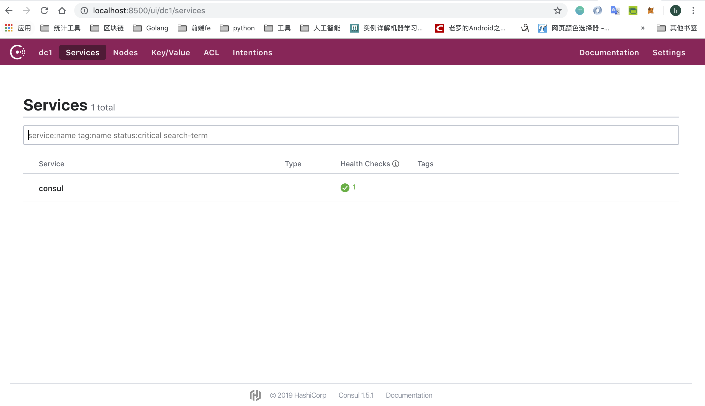

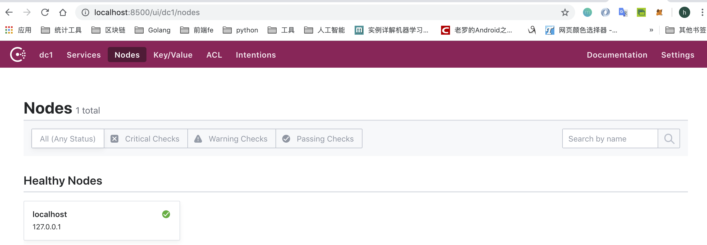

### 4.4、停止服务
在节点运行终端中执行：ctrl + c，表示退出节点运行。


```
2019/06/17 16:21:43 [INFO] agent: Caught signal:  interrupt
2019/06/17 16:21:43 [INFO] agent: Graceful shutdown disabled. Exiting
2019/06/17 16:21:43 [INFO] agent: Requesting shutdown
2019/06/17 16:21:43 [WARN] agent: dev mode disabled persistence, killing all proxies since we can't recover them
2019/06/17 16:21:43 [DEBUG] agent/proxy: Stopping managed Connect proxy manager
2019/06/17 16:21:43 [INFO] consul: shutting down server
2019/06/17 16:21:43 [WARN] serf: Shutdown without a Leave
2019/06/17 16:21:43 [WARN] serf: Shutdown without a Leave
2019/06/17 16:21:43 [INFO] manager: shutting down
2019/06/17 16:21:43 [INFO] agent: consul server down
2019/06/17 16:21:43 [INFO] agent: shutdown complete
2019/06/17 16:21:43 [INFO] agent: Stopping DNS server 127.0.0.1:8600 (tcp)
2019/06/17 16:21:43 [INFO] agent: Stopping DNS server 127.0.0.1:8600 (udp)
2019/06/17 16:21:43 [INFO] agent: Stopping HTTP server 127.0.0.1:8500 (tcp)
2019/06/17 16:21:43 [INFO] agent: Waiting for endpoints to shut down
2019/06/17 16:21:43 [INFO] agent: Endpoints down
2019/06/17 16:21:43 [INFO] agent: Exit code: 1
```

退出节点运行。

### 4.5、consul dev模式示意图
上诉consul agent -dev模式下的启动与运行consul节点。集群中只包含一个节点，唯一的节点被选举成为Leader节点。

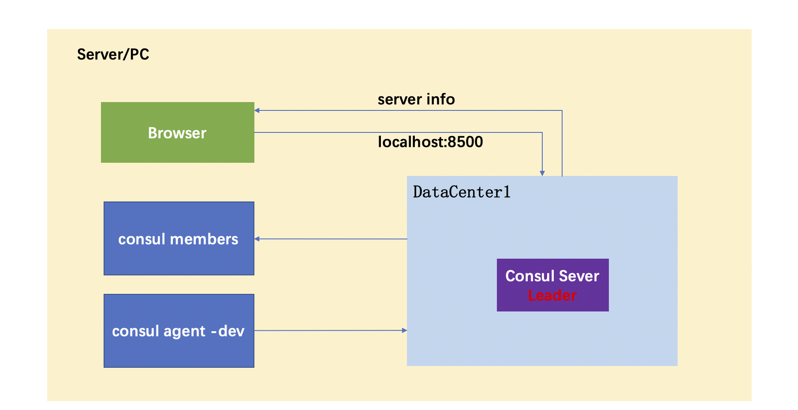

